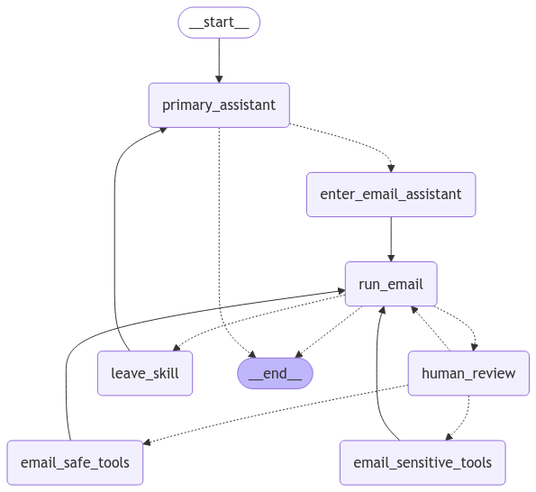

# HIGH LEVEL ARCHITECTURE AI ASSISTANT

View whole picture.
[Click here to view the file](https://drive.google.com/file/d/1840ibIIu7JzL6goKQt6MF9jQyEUHh-s1/view?usp=sharing)

## setup documentation

see documentation [here](./docs/howtosetup.md)

## folder structure

Here's a comprehensive **standard folder structure** for your chatbot project. This structure is designed to support the functionalities you mentioned (authentication, authorization, chatbot logic, RESTful CRUD, PostgreSQL connection, vector database integration), as well as other essential components for a robust application.

---

### **Additional Recommendations**
#### Need to Requirement python_version >= "3.12"